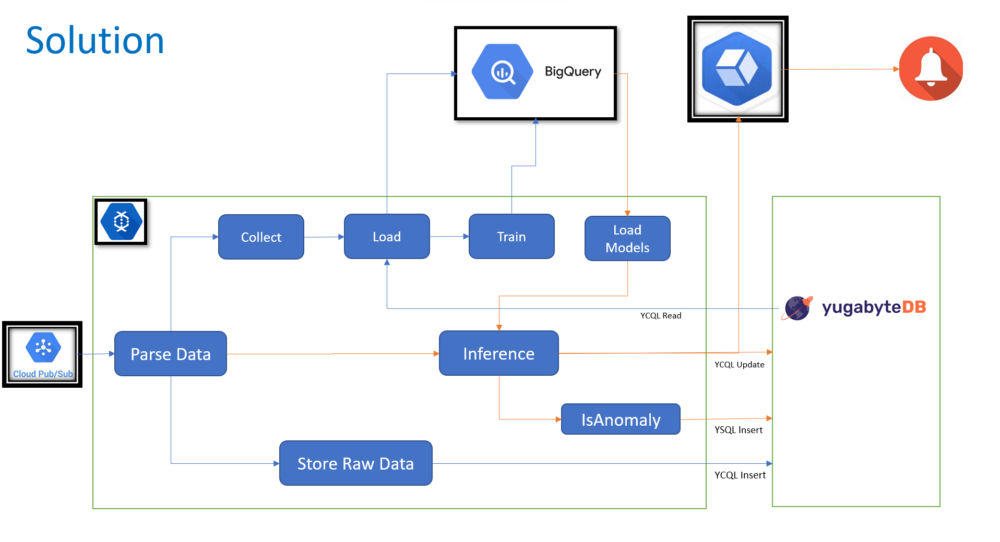

This repo builds following architecture on GCP to train and use ML model, in realtime,  in streaming pipeline. 
This is detailed in this [blog](https://www.kamalsblog.com/2022/02/realtime-model-training-and-anomaly-detection-with-apache-beam.html)



## Deploy

* Create YCQL and YSQL tables in Yugabyte cloud instance. Create table script are in `resources/createyb.txt`  Create your yugabye cloud account [here](https://cloud.yugabyte.com/)

* Create DB Secrets in GCP secret Manager. Since credentials are same for YCQL and YSQL, code use same for both connections
  These details you get after creating YB account.

```
gcloud secrets create cql_user --replication-policy="automatic"
gcloud secrets create cql_password --replication-policy="automatic"
gcloud secrets create cql_host --replication-policy="automatic"
gcloud secrets create cql_ca_cert --replication-policy="automatic"

echo -n "<YB Username>" | gcloud secrets versions add cql_user --data-file=-
echo -n "<YB Password>" | gcloud secrets versions add cql_password --data-file=-
echo -n "<YB Host>" | gcloud secrets versions add cql_host --data-file=-
cat root.crt | gcloud secrets versions add cql_ca_cert --data-file=-

```

* Create a pubsub topic (any name will do) and subscription name `sourcesub`. If you decide to change the subscription name 
then provide that as commandline parameter
```
--input_sub <subscription name>
```

* Submit the job to dataflow (Add input_sub param if required)
```
python process.py \
    --runner DataflowRunner \
    --project < Your Project ID> \
    --temp_location gs://beam-storage-eu-west/tmp/ \  << Change this
    --save_main_session True \
    --region europe-west3 \
    --num_workers 2 \  << Number of workers work well for datagenerator setting (20 samples per second)
    --max_num_workers 3 \
    --setup_file setup.py
```

* Dataflow job takes about 3-4mins to actually startup with set compute nodes.

* Now start your [generator](https://github.com/skamalj/datagenerator) based on cconfig file provided in resources folder.
Do remeber to set you project and topic name in .env file.
* * The config required by this is in "resources/patients.yaml". Copy this file to generators "schema" directory. Then start the generator using below command. This creates data for 10 patients sending 2 samples per second per patient.
* * Make sure generator environment file refers to same pubsub topic on which subscription is attached.

```
 npm start -- -i 500 -s schema/patients.yaml
```

### Anomalies can be checked in "Worker Logs" of dataflow job.  Filter on "Anomaly Detected:"